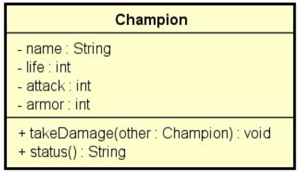

# Desafio "combate"

Em um jogo de combate, cada jogador joga com um campeão. Cada campeão possui um nome, uma quantidade de ataque, armadura
e vida. O combate entre dois campeões é organizado em turnos, de modo que em cada turno, os dois campeões se atacam.
Você deve fazer um programa para instanciar dois campeões, depois executar N turnos de combate, mostrando a cada turno o
estado de cada campeão, conforme exemplos. Se em um turno um dos campeões morrer (quantidade de vida igual a zero), o
combate deve terminar. Ao final do combate, mostrar na tela "FIM DO COMBATE".

A regra para um campeão A receber dano de outro campeão B é a seguinte:

1. A quantidade de vida do campeão A deve ser decrescida da quantidade de ataque do campeão B, descontada a quantidade
   de armadura do campeão A. A quantidade de vida resultante não pode ser menor que zero.
2. Independente da quantidade de armadura do campeão A, pelo menos 1 de vida o campeão A deve perder.

Você deve criar a classe `Champion` para representar o campeão:

- O método `takeDamage(other: Champion)` serve para fazer com que o campeão receba dano advindo do ataque de outro
  campeão, conforme as regras acima.
- O método `status()` deve retornar o nome e a situação de vida do campeão (inclusive com a palavra "(morreu)" se a vida
  estiver a zero).

## Exemplo de entrada e saída

### Entrada

| Entrada                                  | Exemplo 1 | Exemplo 2 |
|:-----------------------------------------|:----------|:----------|
| **Digite os dados do primeiro campeão:** |           |           |
| **Nome:**                                | Darius    | Darius    |
| **Vida inicial:**                        | 50        | 50        |
| **Ataque:**                              | 8         | 8         |
| **Armadura:**                            | 1         | 1         |
| **Digite os dados do segundo campeão:**  |           |           |
| **Nome:**                                | Fiora     | Fiora     |
| **Vida inicial:**                        | 40        | 40        |
| **Ataque:**                              | 10        | 30        |
| **Armadura:**                            | 2         | 10        |
| **Quantos turnos você deseja executar?** | 2         | 4         |

### Saída

| Saída                     | Exemplo 1                               | Exemplo 2                                       |
|:--------------------------|:----------------------------------------|:------------------------------------------------|
| **Resultado do turno 1:** | Darius: 41 de vida Fiora: 34 de vida | Darius: 21 de vida Fiora: 39 de vida         |
| **Resultado do turno 2:** | Darius: 32 de vida Fiora: 28 de vida | Darius: 0 de vida (morreu) Fiora: 38 de vida |
| **Resultado do combate:** | FIM DO COMBATE                          | FIM DO COMBATE                                  |