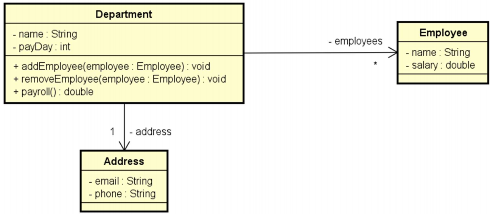
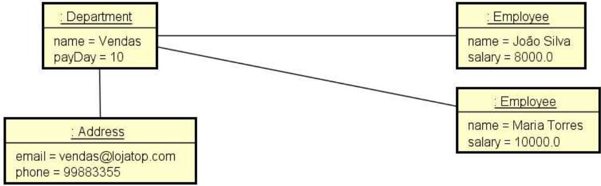

# Problema "Empregados OO"

Fazer um programa para ler os dados de um departamento, que inclui seu endereço e seus empregados.
Em seguida, você deverá mostrar na tela um relatório de folha de pagamento, conforme exemplo.

## Exemplo de entrada e saída

### Entrada

| Entrada                                      | Exemplo 1          |
|:---------------------------------------------|:-------------------|
| **Nome do departamento:**                    | Vendas             |
| **Dia do pagamento:**                        | 10                 |
| **Email:**                                   | vendas@lojatop.com |
| **Telefone:**                                | 99883355           |
| **Quantos funcionários tem o departamento?** | 2                  |
| **Dados do funcionário 1:**                  |                    |
| **Nome:**                                    | João Silva         |
| **Salário:**                                 | 8000.00            |
| **Dados do funcionário 2:**                  |                    |
| **Nome:**                                    | Maria Torres       |
| **Salário:**                                 | 10000.00           |

### Saída

| Saída                                     | Exemplo 1          |
|:------------------------------------------|:-------------------|
| **FOLHA DE PAGAMENTO:**                   |                    |
| **Departamento Vendas =**                 | R$ 18000.00        |
| **Pagamento realizado no dia**            | 10                 |
| **Funcionários:**                         |                    |
|                                           | João Silva         |
|                                           | Maria Torres       |
| **Para dúvidas favor entrar em contato:** | vendas@lojatop.com |

## Utilize a modelagem abaixo para desenvolver a solução

## 🛠️ Tecnologias e Ferramentas

- **Linguagem:** Java (JDK 17+)
- **IDE:** IntelliJ IDEA
- **Controle de Versão:** Git & GitHub
- **Documentação:** Markdown
- **Qualidade de Código:** SonarQube for IDE

 

---

## 👤 Autor

Desenvolvido por Ivan Ferreira.

Copyright © 2026 Ivan Ferreira. Todos os direitos reservados.

## ☕ Sobre

Desafio prático desenvolvido durante os treinamentos de Java da plataforma ⚡**DevSuperior**, ministrados pelo Prof. Dr.
Nélio Alves.