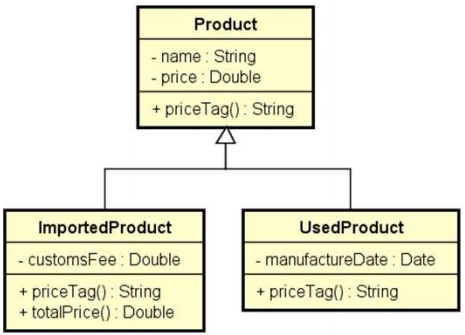

# Problema "Produtos"

Fazer um programa para ler os dados de N produtos (N fornecido pelo usuário). Ao final, mostrar a etiqueta de preço de
cada produto na mesma ordem em que foram digitados.

Todo produto possui nome e preço. Produtos importados possuem uma taxa de alfândega, e produtos usados possuem data de
fabricação. Estes dados específicos devem ser acrescentados na etiqueta de preço conforme exemplo. Para produtos
importados, a taxa de alfândega deve ser acrescentada ao preço final do produto.

## Exemplo de entrada e saída

### Entrada

| Entrada                               | Exemplo 1  |
|:--------------------------------------|:-----------|
| **Enter the number of products:**     | 3          |
| **Product #1 data:**                  |            |
| **Common, used or imported (c/u/i)?** | i          |
| **Name:**                             | Tablet     |
| **Price:**                            | 260.00     |
| **Customs fee:**                      | 20.00      |
| **Product #2 data:**                  |            |
| **Common, used or imported (c/u/i)?** | c          |
| **Name:**                             | Notebook   |
| **Price:**                            | 1100.00    |
| **Product #3 data:**                  |            |
| **Common, used or imported (c/u/i)?** | u          |
| **Name:**                             | Iphone     |
| **Price:**                            | 400.00     |
| **Manufacture date (DD/MM/YYYY):**    | 15/03/2017 |

### Saída

| Saída           | Exemplo 1                                             |
|:----------------|:------------------------------------------------------|
| **PRICE TAGS:** |                                                       |
|                 | Tablet $ 280.00 (Customs fee: $ 20.00)                |
|                 | Notebook $ 1100.00                                    |
|                 | Iphone (used) $ 400.00 (Manufacture date: 15/03/2017) |

## Utilize a modelagem abaixo para desenvolver a solução

---

## 👤 Autor

Desenvolvido por Ivan Ferreira.

Copyright © 2026 Ivan Ferreira. Todos os direitos reservados.

---

## ☕ Sobre

Exercício prático desenvolvido durante os treinamentos de Java da plataforma ⚡**DevSuperior**, ministrados pelo Prof. Dr.
Nélio Alves.