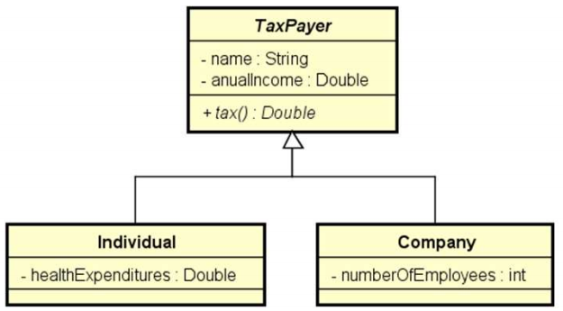

# Problema "Contribuintes"

Fazer um programa para ler os dados de N contribuintes (N fornecido pelo usuário), os quais podem ser pessoa física ou
pessoa jurídica, e depois mostrar o valor do imposto pago por cada um, bem como o total de imposto arrecadado.

Os dados de pessoa física são: nome, renda anual e gastos com saúde. Os dados de pessoa jurídica são nome, renda anual e
número de funcionários. As regras para cálculo de imposto são as seguintes:

* **Pessoa física:** pessoas cuja renda foi abaixo de 20000.00 pagam 15% de imposto. Pessoas com renda de 20000.00 em
  diante pagam 25% de imposto. Se a pessoa teve gastos com saúde, 50% destes gastos são abatidos no imposto.
* **Pessoa jurídica:** pessoas jurídicas pagam 16% de imposto. Porém, se a empresa possuir mais de 10 funcionários, ela
  paga 14% de imposto.

## Exemplo de entrada e saída

### Entrada

| Entrada                             | Exemplo 1 |
|:------------------------------------|:----------|
| **Enter the number of tax payers:** | 3         |
| **Tax payer #1 data:**              |           |
| **Individual or company (i/c)?**    | i         |
| **Name:**                           | Alex      |
| **Anual income:**                   | 50000.00  |
| **Health expenditures:**            | 2000.00   |
| **Tax payer #2 data:**              |           |
| **Individual or company (i/c)?**    | c         |
| **Name:**                           | SoftTech  |
| **Anual income:**                   | 400000.00 |
| **Number of employees:**            | 25        |
| **Tax payer #3 data:**              |           |
| **Individual or company (i/c)?**    | i         |
| **Name:**                           | Bob       |
| **Anual income:**                   | 120000.00 |
| **Health expenditures:**            | 1000.00   |

### Saída

| Saída            | Exemplo 1  |
|:-----------------|:-----------|
| **TAXES PAID:**  |            |
| **Alex:**        | $ 11500.00 |
| **SoftTech:**    | $ 56000.00 |
| **Bob:**         | $ 29500.00 |
|                  |            |
| **TOTAL TAXES:** | $ 97000.00 |

## Utilize a modelagem abaixo para desenvolver a solução

---

## 👤 Autor

Desenvolvido por Ivan Ferreira.

Copyright © 2026 Ivan Ferreira. Todos os direitos reservados.

---

## ☕ Sobre

Exercício prático desenvolvido durante os treinamentos de Java da plataforma ⚡**DevSuperior**, ministrados pelo Prof. Dr.
Nélio Alves.