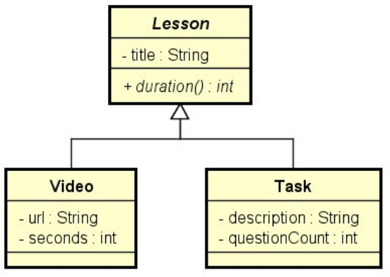

# Desafio "Plataforma de ensino"

Fazer um programa para ler os dados das aulas de um curso, e em seguida mostrar a duração total do curso, que é a soma
das durações de cada aula. Cada aula pode ser um conteúdo em vídeo, ou então uma tarefa. A duração (em segundos) de uma
aula vídeo é a própria duração do vídeo, e a duração de uma aula tarefa é de cinco minutos por questão (exemplo: se a
tarefa possui 3 questões, então a duração da tarefa é 15 minutos).

## Exemplo de entrada e saída

### Entrada

| Entrada                        | Exemplo 1                              |
|:-------------------------------|:---------------------------------------|
| **Quantas aulas tem o curso?** | 3                                      |
| **Dados da 1a aula:**          |                                        |
| **Conteúdo ou tarefa (c/t)?**  | c                                      |
| **Título:**                    | Orientação a objetos                   |
| **URL do vídeo:**              | https://youtu.be/aBh                   |
| **Duração em segundos:**       | 310                                    |
| **Dados da 2a aula:**          |                                        |
| **Conteúdo ou tarefa (c/t)?**  | c                                      |
| **Título:**                    | Listas em Java                         |
| **URL do vídeo:**              | https://youtu.be/e5a                   |
| **Duração em segundos:**       | 250                                    |
| **Dados da 3a aula:**          |                                        |
| **Conteúdo ou tarefa (c/t)?**  | t                                      |
| **Título:**                    | Exercício de fixação                   |
| **Descrição:**                 | Faça um programa que imprima uma lista |
|

## Utilize a modelagem abaixo para desenvolver a solução

---

## 👤 Autor

Desenvolvido por Ivan Ferreira.

Copyright © 2026 Ivan Ferreira. Todos os direitos reservados.

## ☕ Sobre

Desafio prático desenvolvido durante os treinamentos de Java da plataforma ⚡**DevSuperior**, ministrados pelo Prof. Dr.
Nélio Alves.