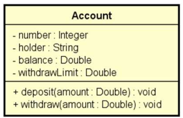

# Problema "conta bancária"

Fazer um programa para ler os dados de uma conta bancária e depois realizar um saque nesta conta bancária, mostrando o
novo saldo. Um saque não pode ocorrer ou se não houver saldo na conta, ou se o valor do saque for superior ao limite de
saque da conta.

## Exemplo de entrada e saída

### Entrada

| Entrada                  | Exemplo 1 | Exemplo 2 | Exemplo 3 |
|:-------------------------|:----------|:----------|:----------|
| **Number:**              | 8021      | 8021      | 8021      |
| **Holder:**              | Bob Brown | Bob Brown | Bob Brown |
| **Initial balance:**     | 500.00    | 500.00    | 200.00    |
| **Withdraw limit:**      | 300.00    | 300.00    | 300.00    |
| **Amount for withdraw:** | 100.00    | 400.00    | 250.00    |

### Saída

| Saída          | Exemplo 1           | Exemplo 2                                         | Exemplo 3                          |
|:---------------|:--------------------|:--------------------------------------------------|:-----------------------------------|
| **Resultado:** | New balance: 400.00 | Withdraw error: The amount exceeds withdraw limit | Withdraw error: Not enough balance |

## Utilize a modelagem abaixo para desenvolver a solução

---

## 👤 Autor

Desenvolvido por Ivan Ferreira.

Copyright © 2026 Ivan Ferreira. Todos os direitos reservados.

## ☕ Sobre

Exercício prático desenvolvido durante os treinamentos de Java da plataforma ⚡**DevSuperior**, ministrados pelo Prof. Dr.
Nélio Alves.