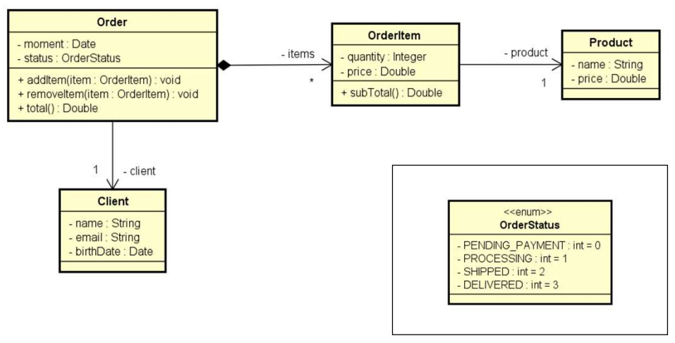
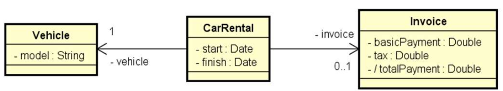
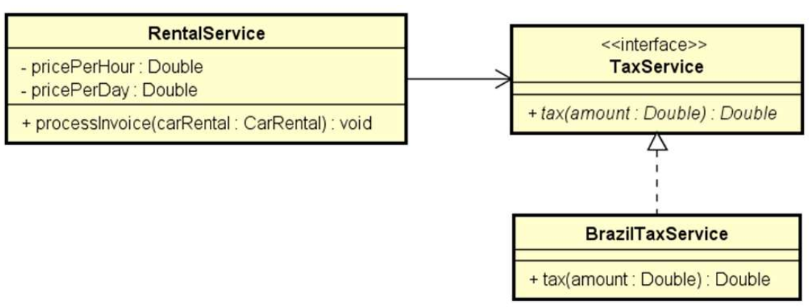

# Problema "Locadora de Carros"

Uma locadora brasileira de carros cobra um valor por hora para locações de até 12 horas. Porém, se a duração da locação
ultrapassar 12 horas, a locação será cobrada com base em um valor diário. Além do valor da locação, é acrescido no preço
o valor do imposto conforme regras do país que, no caso do Brasil, é 20% para valores até 100.00, ou 15% para valores
acima de 100.00. Fazer um programa que lê os dados da locação (modelo do carro, instante inicial e final da locação),
bem como o valor por hora e o valor diário de locação. O programa deve então gerar a nota de pagamento (contendo valor
da locação, valor do imposto e valor total do pagamento) e informar os dados na tela. Veja os exemplos.

## Exemplo de entrada e saída

### Entrada

| Entrada                          | Exemplo 1        | Exemplo 2        |
|:---------------------------------|:-----------------|:-----------------|
| **Modelo do carro:**             | Civic            | Civic            |
| **Retirada (dd/MM/yyyy HH:mm):** | 25/06/2018 10:30 | 25/06/2018 10:30 |
| **Retorno (dd/MM/yyyy HH:mm):**  | 25/06/2018 14:40 | 27/06/2018 11:40 |
| **Entre com o preço por hora:**  | 10.00            | 10.00            |
| **Entre com o preço por dia:**   | 130.00           | 130.00           |

### Saída

| Saída                 | Exemplo 1 | Exemplo 2 |
|:----------------------|:----------|:----------|
| **Pagamento basico:** | 50.00     | 390.00    |
| **Imposto:**          | 10.00     | 58.50     |
| **Pagamento total:**  | 60.00     | 448.50    |

## Utilize as modelagens abaixo para desenvolver a solução

### Diagrama de classes - UML (Entities)

### Diagrama de Classes - UML (Domain layer design)

### Diagrama de Classes - UML (Domain layer design)

---

## 👤 Autor

Desenvolvido por Ivan Ferreira.

Copyright © 2026 Ivan Ferreira. Todos os direitos reservados.

## ☕ Sobre

Exercício prático desenvolvido durante os treinamentos de Java da plataforma ⚡**DevSuperior**, ministrados pelo Prof. Dr.
Nélio Alves.