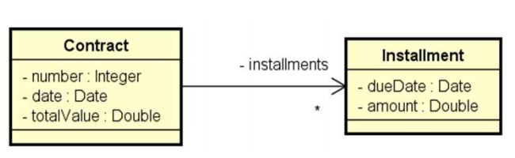
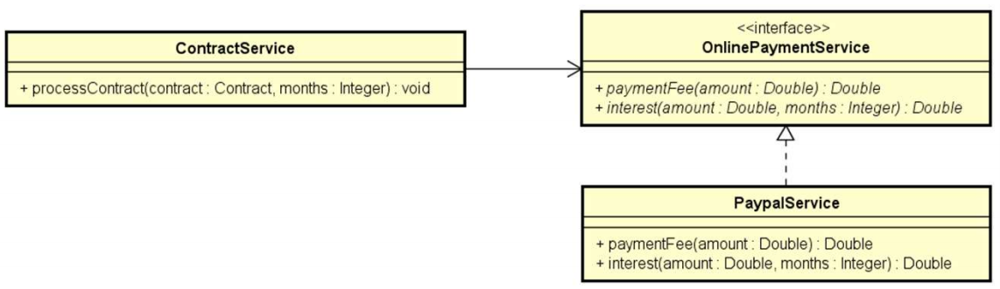

# Problema "Processamento de Contratos"

Uma empresa deseja automatizar o processamento de seus contratos. O processamento de um contrato consiste em gerar as
parcelas a serem pagas para aquele contrato, com base no número de meses desejado.

A empresa utiliza um serviço de pagamento online para realizar o pagamento das parcelas. Os serviços de pagamento online
tipicamente cobram um juro mensal, bem como uma taxa por pagamento. Por enquanto, o serviço contratado pela empresa é o
do Paypal, que aplica juros simples de 1% a cada parcela, mais uma taxa de pagamento de 2%.

Fazer um programa para ler os dados de um contrato (número do contrato, data do contrato, e valor total do contrato). Em
seguida, o programa deve ler o número de meses para parcelamento do contrato, e daí gerar os registros de parcelas a
serem pagas (data e valor), sendo a primeira parcela a ser paga um mês após a data do contrato, a segunda parcela dois
meses após o contrato e assim por diante. Mostrar os dados das parcelas na tela.

## Exemplo de entrada e saída

### Entrada

| Entrada                             | Exemplo 1  |
|:------------------------------------|:-----------|
| **Numero:**                         | 8028       |
| **Data (dd/MM/yyyy):**              | 25/06/2018 |
| **Valor do contrato:**              | 600.00     |
| **Entre com o numero de parcelas:** | 3          |

### Saída

| Saída          | Exemplo 1           |
|:---------------|:--------------------|
| **Parcela 1:** | 25/07/2018 - 206.04 |
| **Parcela 2:** | 25/08/2018 - 208.08 |
| **Parcela 3:** | 25/09/2018 - 210.12 |

## Utilize as modelagens abaixo para desenvolver a solução

### Diagrama de classes - UML (Entities)

### Diagrama de Classes - UML (Domain layer design)

---

## 🧠 Conhecimentos e Tecnologias Aplicadas

Neste projeto, foram aplicados conceitos fundamentais de Programação Orientada a Objetos (POO) e princípios de design de software para garantir um código limpo, de fácil manutenção e escalável:

* **Programação Orientada a Objetos (POO):** Modelagem do domínio utilizando classes, atributos, métodos, construtores e encapsulamento.
* **Associação de Objetos (Composição):** Implementação de um relacionamento "um-para-muitos", onde um objeto `Contract` possui e gerencia uma lista de objetos `Installment` (Parcelas).
* **Interfaces:** Criação da interface `OnlinePaymentService` para estabelecer um contrato de comportamento (cálculo de taxas e juros) para qualquer serviço de pagamento.
* **Inversão de Controle e Injeção de Dependência:** O `ContractService` não instancia diretamente o `PaypalService`. Em vez disso, ele exige uma interface `OnlinePaymentService` em seu construtor. Isso permite injetar qualquer serviço de pagamento dinamicamente.
* **Fraco Acoplamento (Princípios SOLID):** Graças à Injeção de Dependência, a camada de serviço fica desacoplada de bibliotecas ou regras específicas de um único provedor de pagamento (Princípio de Inversão de Dependência - DIP). Se amanhã a empresa mudar para o *Stripe* ou *PagSeguro*, basta criar uma nova classe que implemente a interface, sem alterar o `ContractService`.
* **Arquitetura em Camadas:** Divisão estrutural e lógica das responsabilidades do projeto:
    * `entities`: Representação dos dados de domínio.
    * `services`: Encapsulamento das regras de negócio e integrações.
    * `application`: Ponto de entrada (Main) e interação com o usuário.
* **Data e Hora (API Java 8+):** Manipulação de tempo utilizando `java.time.LocalDate` para calcular os vencimentos meses à frente de forma segura, junto com `DateTimeFormatter` para exibição padronizada.
* **Coleções (Collections):** Utilização de `List` e `ArrayList` para armazenar as parcelas geradas em tempo de execução.

---

## 👤 Autor

Desenvolvido por Ivan Ferreira.

Copyright © 2026 Ivan Ferreira. Todos os direitos reservados.

## ☕ Sobre

Exercício prático desenvolvido durante os treinamentos de Java da plataforma ⚡**DevSuperior**, ministrados pelo Prof. Dr.
Nélio Alves.